# Tarea 3 DI - Valentina Alessandra Calicchia

Esta tarea es el desarrollo de un Gestor de Reservas para un hotel. Se ha realizado con Python, PySide6 y MySql. A través de este gestor, el usuario puede crear y modificar reservas de los distintos salones disponibles de un hotel.

Para poner a correr el código debemos seguir estos pasos:

1. Vamos a la ruta de proyecto, instalamos las dependencias:

> pip install -r requirements.txt

2. Levantamos el contenedor para la base de datos:

> docker compose up

3. Ejecutamos el archivo main.py

# Uso de la App

Esta app es bastante sencilla de usar, primero debemos logarnos con las credenciales correctas (indicadas en la tarea):

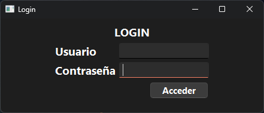

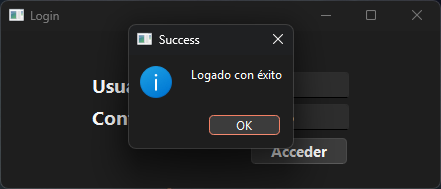

Una vez dentro, veremos dos recuadros, uno con los salones disponibles y otro con la tabla de las reservas hechas para el salón seleccionado, si cambiamos de salón, se filtrará por ese criterio:

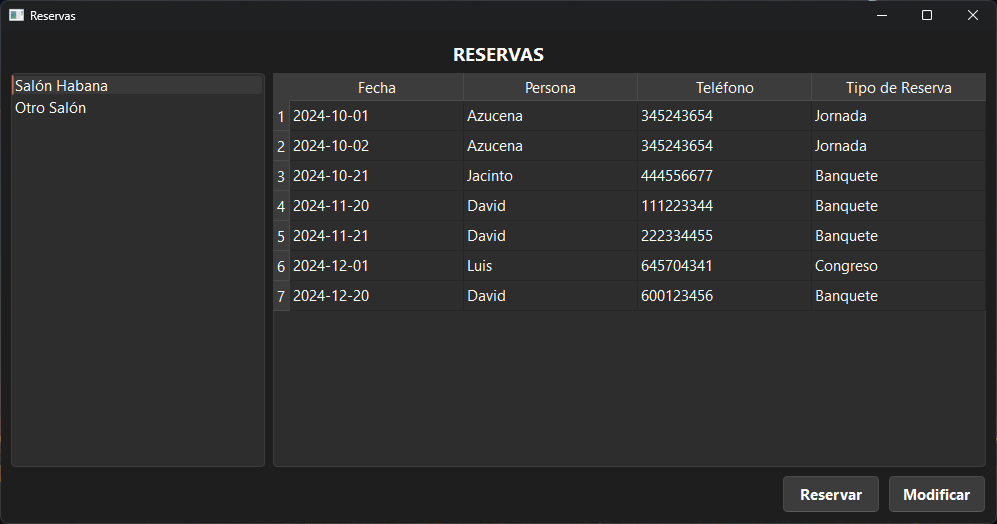

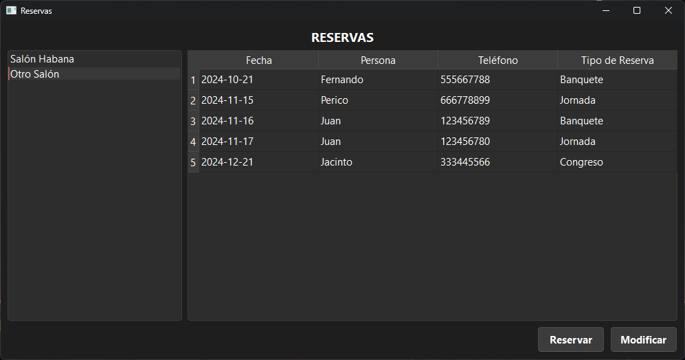

Tenemos abajo dos opciones, si damos a "Reservar" nos abrirá un formulario desde el cual podremos crear una nueva reserva para el salón que tengamos seleccionado:

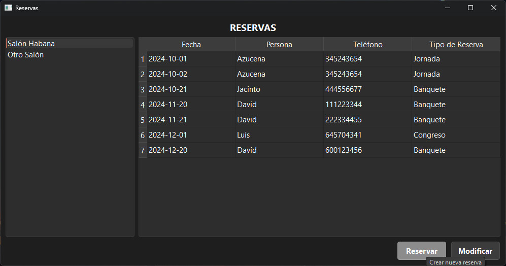

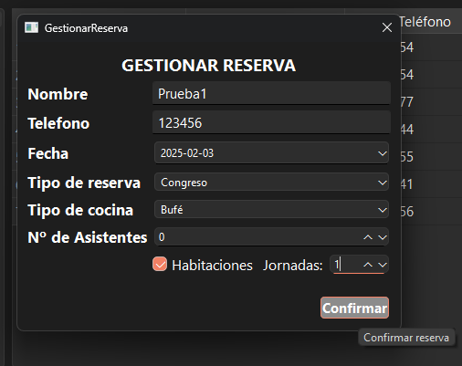

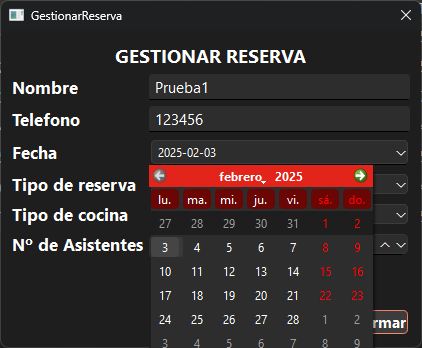

Guardamos dando al botón de "Confirmar":

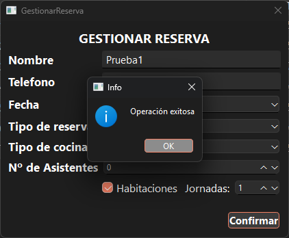

Y como podemos ver, esta aparecerá en nuestra tabla:

Para modificar es igual de sencillo, simplemente debemos seleccionar la reserva que queramos editar y darle a botón "Modificar"

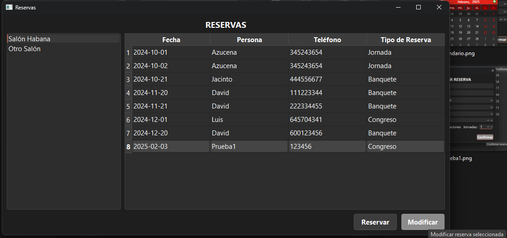

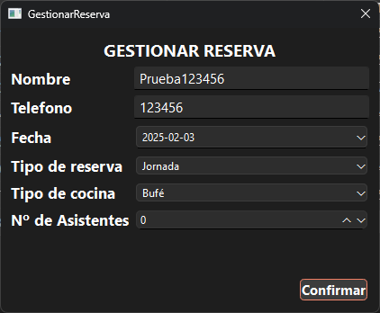

Guardamos, y se actualizan los datos:

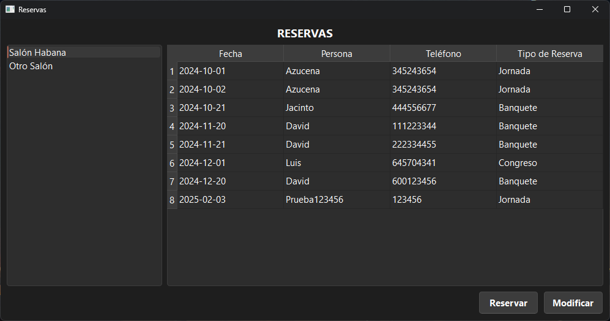

Y eso sería todo :)